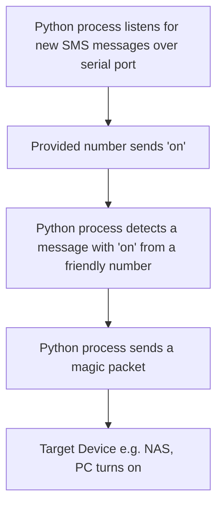

# Wake-on-Lan via SMS using RaspberryPi

Remotely wake on your home computer or NAS using an SMS message. <br>
**This script allows sending magic packet inside your LAN network, without forwarding any of it's ports to the public.** <br>

This project uses RaspberryPi 4B with Waveshare SIM7600E-H Hat GSM module (https://www.waveshare.com/wiki/SIM7600E-H_4G_HAT). <br>
This module was used, as i already had it but this script should also work, with any GSM module that allows for serial communication and uses standard AT commands [see hardware section for more](#hardware-requirements)

## Why?

Most remote WoL solutions require **port forwarding**, which opens up your local network to external traffic. This setup offers an **safer alternative**, letting you send a magic packet securely via SMS — no opened network access required.

# How does it work?


## Software stack
- `Python` 
- `pyserial` for serial communication
- `AT` commands for controlling the GSM module
- `wakeonlan` package
- `cron` for autostart on boot
- Linux
- `bash` scripting

## Hardware Requirements
-  Raspberry Pi 4B (other models may work)
-  SIM7600E-H *
-  Configured and activated SIM card
-  Target device that supports Wake-on-LAN

* Consider using a cheaper alternative, as this high speed LTE Cat-4 module is an overkill for this project. Something like SIM800L (https://www.waveshare.com/wiki/SIM800C_GSM/GPRS_HAT or https://botland.store/withdrawn-products/8891-module-gsm-gprs-sim800l.html) is cheap and should work just as fine. Probably even the serial port would be the same, so it should work as plug an play with this project. <br>
**Remeber that when you use minicom, the serial port will be occupied by it, so magic packet won't be send.**


## Issue genesis

As an EE engineering student I often need to use Windows machine to run specific software, however my favourite and most used computer is a Macbook that runs on MacOS.<br> **Solution?** <br> 
Leave Windows machine at home and run remote desktop to access it and do work anywhere, from my macbook laptop. <br>
**However, a new problem arises:** <br>
Leaving my PC always on would lead to immense power consumption over time, as well as faster component wear. <br>
**Solution II?** <br>
Turn on my Windows remotely by sending magic packet to it's mac address. The most common way to do that would be to set up a VPN, open a communication port and access my LAN network remotely. <br>
**But this action poses a serious security threat, as opening your LAN to the internet means two things:**
- Difficult configuration - correctly setting DHCP, opening network port, generating SSH key for safe communication, mocking a static public IP (as most home networks don't have a static public IP)
- **Exposing your LAN for dangerous attacks** - there are malicious bots that scan WAN in search for open networks, try breaking into them and then can pose **serious attacks, like e.g Man in the Middle attack**. Not correctly configure open LAN can mean not only unwanted users inside your LAN, attacks on devices in your home network, but also a threat for your passwords, bank accounts, etc.<br>

While opening your LAN and making a vpn might have sense when you need to remotely access files, servers, etc. it doesn't make sense when the only thing that needs remote access is sending a magic packet to wake on your PC. **This is, where my project comes in handy as it allows to send WoL packets, without opening your network.**

## Setup    
### Steps to config SIM7600E H on rpi 4B:
1. ssh into your rpi
2. ```sudo raspi-config```
  Here get into interface options (3), then serial port (6), **login shell to be accessible over serial? - NO**, **serial port hardware to be enabled? YES**,
3. ```sudo reboot```

### Wake on Lan configuration using provided .sh file (automatic)
Assuming newly installed linux OS:
```bash
1. sudo apt update
2. udo apt install git
3. mkdir wol
4. cd wol
5. git clone https://github.com/AlexSzczygielski/wake-on-lan-sms-pi.git
6. cd wake-on-lan-sms-pi/
7. chmod +x setup_wol_sms.sh
8. ./setup_wol_sms.sh
```

### Steps to manually configure wake on lan (after GSM module is up and running)
```bash
1. sudo apt update
2. (optional - if you want to debug) sudo apt-get install minicom
3. sudo apt install wakeonlan
4. python --version (check if you have python installed)
5. sudo apt-get install python3-serial
6. sudo apt install git
7. mkdir wol
8. cd wol
9. git clone https://github.com/AlexSzczygielski/wake-on-lan-sms-pi.git
10. cd wake-on-lan-sms-pi/
11. nano config.ini (fill it with required data and save)
12. nano smsWake.py
13. Here change line: config.read('/home/pi/Desktop/config.ini'), Change this to your file path (line 27), save and exit
14. (optional) python smsWake.py - check if the file compiles correctly
15. cd ~
16. crontab -e
17. @reboot python /home/pi/Desktop/smsWake.py' (Add this at the end of crontab file, change this to your file path, save and exit)
18. sudo reboot
```
 <br>

After that the **python script should automatically start**, every time the RPi turns on. To check if it runs you can use: <br>

`ps aux|grep python` <br>

To see what happens at the serial port you can use minicom: <br>

`minicom -D /dev/ttyS0` (may need to adjust port) <br>

**Remeber that when you use minicom, the serial port will be occupied by it, so magic packet won't be send.**
